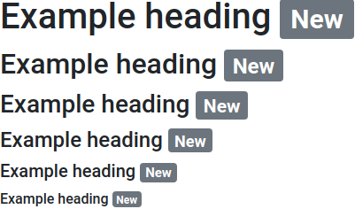
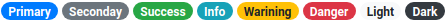
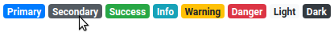

# @lit-element-bootstrap/badge

An implementation of Bootstrap v4.3.1 alert components in LitElement.

## Live demo

[Go to live demo](https://lit-element-bootstrap.dev/component/badges)

## Installation

Install via npm:

```shell
npm install @lit-element-bootstrap/badge
```

Install via yarn:

```shell
yarn add @lit-element-bootstrap/badge
```

Install via unpkg:

```html
https://unpkg.com/@lit-element-bootstrap/badge@latest/unpkg/index.bundled.js
```

## Import

import all modules:

```javascript
import '@lit-element-bootstrap/badge';
```

import specific module (preferred):

```javascript
import '@lit-element-bootstrap/badge/bs-badge.js';
```

import specific class:

```javascript
// import specific class from all modules
import { BsBadge } from '@lit-element-bootstrap/badge';

// import specific class
import { BsBadge } from '@lit-element-bootstrap/badge/bs-badge.js';
```

## Examples

Badge inside a heading

```html
<h1>Example heading <bs-badge context="secondary">New</bs-badge></h1>
<h2>Example heading <bs-badge context="secondary">New</bs-badge></h2>
<h3>Example heading <bs-badge context="secondary">New</bs-badge></h3>
<h4>Example heading <bs-badge context="secondary">New</bs-badge></h4>
<h5>Example heading <bs-badge context="secondary">New</bs-badge></h5>
<h6>Example heading <bs-badge context="secondary">New</bs-badge></h6>
```



Badge inside a button

```html
<bs-button primary> Notifications 
    <bs-badge context="light">4</bs-badge>
</bs-button>
```


Badges in context

```html
<span><bs-badge context="primary">Primary</bs-badge></span>
<span><bs-badge context="secondary">Seconday</bs-badge></span>
<span><bs-badge context="success">Success</bs-badge></span>
<span><bs-badge context="info">Info</bs-badge></span>
<span><bs-badge context="warning">Warining</bs-badge></span>
<span><bs-badge context="danger">Danger</bs-badge></span>
<span><bs-badge context="light">Light</bs-badge></span>
<span><bs-badge context="dark">Dark</bs-badge></span>
```


Badges as pills in context

```html
<span><bs-badge pill context="primary">Primary</bs-badge></span>
<span><bs-badge pill context="secondary">Seconday</bs-badge></span>
<span><bs-badge pill context="success">Success</bs-badge></span>
<span><bs-badge pill context="info">Info</bs-badge></span>
<span><bs-badge pill context="warning">Warining</bs-badge></span>
<span><bs-badge pill context="danger">Danger</bs-badge></span>
<span><bs-badge pill context="light">Light</bs-badge></span>
<span><bs-badge pill context="dark">Dark</bs-badge></span>
```



Badge links in context

```html
<bs-badge-link context="primary">Primary</bs-badge-link>
<bs-badge-link context="secondary">Secondary</bs-badge-link>
<bs-badge-link context="success">Success</bs-badge-link>
<bs-badge-link context="info">Info</bs-badge-link>
<bs-badge-link context="warning">Warning</bs-badge-link>
<bs-badge-link context="danger">Danger</bs-badge-link>
<bs-badge-link context="light">Light</bs-badge-link>
<bs-badge-link context="dark">Dark</bs-badge-link>
```



## Components

Tag | Class |
--- | --- |
`<bs-badge>` | BsBadge |
`<bs-badge-link>` | BsBadgeLink |

## Theming

### bs-badge

Property | Default value | Description
--- | --- | --- |
 --badge-color | user agent | Text color |
 --badge-bg-color | user agent | Background color |
 --badge-pd-top | 0.25em | Padding top |
 --badge-pd-bottom | 0.25em | Padding bottom |
 --badge-pd-left  | 0.4em | Padding left |
 --badge-pd-right | 0.4em | Padding right |
 --badge-font-size | 75% | Font size |
 --badge-font-wg | 700 | Font weight |
 --badge-line-hg | 1 | Line height |
 --badge-text-align | center | Badge text align |
 --badge-bd-radius | 0.25rem | Border radius |
 --badge-pill-pd-top | 0.6em | Pill padding top |
 --badge-pill-pd-left | 0.6em | Pill padding left |
 --badge-pill-bd-radius | 10rem | Pill border radius |
 --badge-primary-color | #fff | Primary context text color |
 --badge-primary-bg-color | #007bff | Primary context background color |
 --badge-secondary-color | #fff | Secondary context text color |
 --badge-secondary-bg-color | #6c757d | Secondary context background color |
 --badge-success-color | #fff | Success context text color |
 --badge-success-bg-color | #28a745 | Success context background color |
 --badge-info-color | #fff | Info context text color |
 --badge-info-bg-color | #17a2b8 | Info context background color |
 --badge-warning-color | #212529 | Wrning context text color |
 --badge-warning-bg-color | #ffc107 | Warning context background color |
 --badge-danger-color | #fff | Danger context text color |
 --badge-danger-bg-color | #dc3545 | Danger context background color |
 --badge-light-color | #212529 | Light context text color |
 --badge-light-bg-color | #f8f9fa | Light context background color |
 --badge-dark-color | #fff | Dark context text color |
 --badge-dark-bg-color | #343a40 | Dark context background color |

### bs-badge-link

Property | Default value | Description
--- | --- | --- |
--badge-link-color | #007bff | Text color
--badge-link-bg-color | transparent | Background color
--badge-link-pd-top | 0.25em | Padding top
--badge-link-pd-bottom | 0.25em | Padding bottom
--badge-link-pd-left | 0.4em | Padding left
--badge-link-pd-right | 0.4em | Padding right
--badge-link-font-size | 75% | Font size
--badge-link-font-wg | 700 | Font weight
--badge-link-line-hg | 1 | Line height
--badge-link-text-align | center | Text align
--badge-link-bd-radius | 0.25rem | Border radius
--badge-link-pill-pd-top | 0.6em | Pill padding right
--badge-link-pill-pd-left | 0.6em | Pill padding left
--badge-link-pill-bd-radius | 10rem | Pill border radius
--badge-link-primary-color | #fff | Primary context text color
--badge-link-primary-bg-color | #007bff | Primary context background color
--badge-link-primary-text-decoration | none | Primary context text decoration
--badge-link-primary-hover-color | #fff | Primary context hover text color
--badge-link-primary-hover-bg-color | #0062cc | Primary context hover background color
--badge-link-primary-focus-color | #fff | Primary context focus text color
--badge-link-primary-focus-bg-color | #0062cc | Primary context focus background color
--badge-link-primary-link-outline | 0 | Primary context link outline
--badge-link-primary-link-box-shadow | 0 0 0 0.2rem rgba(0, 123, 255, 0.5) | Primary context link box shadow
--badge-link-secondary-color | #fff | Secondary context text color
--badge-link-secondary-bg-color | #6c757d | Secondary context background color
--badge-link-secondary-text-decoration | none | Secondary context text decoration
--badge-link-secondary-hover-color | #fff | Secondary context hover text color
--badge-link-secondary-hover-bg-color | #545b62 | Secondary context hover background color
--badge-link-secondary-focus-color | #fff | Secondary context focus text color
--badge-link-secondary-focus-bg-color | #545b62 | Secondary context focus background color
--badge-link-secondary-link-outline | 0 | Secondary context link outline
--badge-link-secondary-link-box-shadow | 0 0 0 0.2rem rgba(108, 117, 125, 0.5) | Secondary context link box shadow
--badge-link-success-color | #fff | Success context text color
--badge-link-success-bg-color | #28a745 | Success context background color
--badge-link-success-text-decoration | none | Success context text decoration
--badge-link-success-hover-color | #fff | Success context hover text color
--badge-link-success-hover-bg-color | #1e7e34 | Success context hover background color
--badge-link-success-focus-color | #fff | Success context focus text color
--badge-link-success-focus-bg-color | #1e7e34 | Success context focus background color
--badge-link-success-link-outline | 0 | Success context link outline
--badge-link-success-link-box-shadow | 0 0 0 0.2rem rgba(40, 167, 69, 0.5) | Success context link box shadow
--badge-link-info-color | #fff | Info context text color
--badge-link-info-bg-color | #17a2b8 | Info context background color
--badge-link-info-text-decoration | none | Info context text decoration
--badge-link-info-hover-color | #fff | Info context hover text color
--badge-link-info-hover-bg-color | #117a8b | Info context hover background color
--badge-link-info-focus-color | #fff | Info context focus text color
--badge-link-info-focus-bg-color | #117a8b | Info context focus background color
--badge-link-info-link-outline | 0 | Info context link outline
--badge-link-info-link-box-shadow | 0 0 0 0.2rem rgba(23, 162, 184, 0.5) | Info context link box shadow
--badge-link-warning-color | #212529 | Warning context text color
--badge-link-warning-bg-color | #ffc107 | Warning context background color
--badge-link-warning-text-decoration | none | Warning context text decoration
--badge-link-warning-hover-color | #212529 | Warning context hover text color
--badge-link-warning-hover-bg-color | #d39e00 | Warning context hover background color
--badge-link-warning-focus-color | #212529 | Warning context focus text color
--badge-link-warning-focus-bg-color | #d39e00 | Warning context focus background color
--badge-link-warning-link-outline | 0 | Warning context link outline
--badge-link-warning-link-box-shadow | 0 0 0 0.2rem rgba(255, 193, 7, 0.5) | Warning context link box shadow
--badge-link-danger-color | #fff | Danger context text color
--badge-link-danger-bg-color | #dc3545 | Danger context background color
--badge-link-danger-text-decoration | none | Danger context text decoration
--badge-link-danger-hover-color | #fff | Danger context hover text color
--badge-link-danger-hover-bg-color | #bd2130 | Danger context hover background color
--badge-link-danger-focus-color | #fff | Danger context focus text color
--badge-link-danger-focus-bg-color | #bd2130 | Danger context focus background color
--badge-link-danger-link-outline | 0 | Danger context link outline
--badge-link-danger-link-box-shadow | 0 0 0 0.2rem rgba(220, 53, 69, 0.5) | Danger context link box shadow
--badge-link-light-color | #212529 | Light context text color
--badge-link-light-bg-color | #f8f9fa | Light context background color
--badge-link-light-text-decoration | none | Light context text decoration
--badge-link-light-hover-color | #212529 | Light context hover text color
--badge-link-light-hover-bg-color | #dae0e5 | Light context hover background color
--badge-link-light-focus-color | #212529 | Light context focus text color
--badge-link-light-focus-bg-color | #dae0e5 | Light context focus background color
--badge-link-light-link-outline | 0 | Light context link outline
--badge-link-light-link-box-shadow | 0 0 0 0.2rem rgba(248, 249, 250, 0.5) | Light context link box shadow
--badge-link-dark-color | #fff | Dark context text color
--badge-link-dark-bg-color | #f8f9fa | Dark context background color
--badge-link-dark-text-decoration | none | Dark context text decoration
--badge-link-dark-hover-color | #fff | Dark context hover text color
--badge-link-dark-hover-bg-color | #1d2124 | Dark context hover background color
--badge-link-dark-focus-color | #fff | Dark context focus text color
--badge-link-dark-focus-bg-color | #1d2124 | Dark context focus background color
--badge-link-dark-link-outline | 0 | Dark context link outline
--badge-link-dark-link-box-shadow | 0 0 0 0.2rem rgba(52, 58, 64, 0.5) | Dark context link box shadow |
