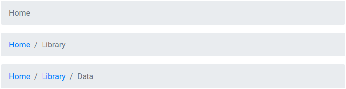
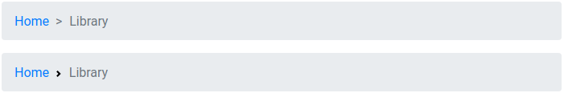

# @lit-element-bootstrap/breadcrumb

An implementation of Bootstrap v4.3.1 breadcrumb components in LitElement.

## Live demo

[Go to live demo](https://lit-element-bootstrap.dev/component/breadcrumbs)

## Installation

Install via npm:

```shell
npm install @lit-element-bootstrap/breadcrumb
```

Install via yarn:

```shell
yarn add @lit-element-bootstrap/breadcrumb
```

Install via unpkg:

```html
https://unpkg.com/@lit-element-bootstrap/breadcrumb@latest/unpkg/index.bundled.js
```

## Import

import all modules:

```javascript
import '@lit-element-bootstrap/breadcrumb';
```

import specific module (preferred):

```javascript
import '@lit-element-bootstrap/breadcrumb/bs-breadcrumb.js';
```

import specific class:

```javascript
// import specific class from all modules
import { BsBreadcrumb } from '@lit-element-bootstrap/breadcrumb';

// import specific class
import { BsBreadcrumb } from '@lit-element-bootstrap/breadcrumb/bs-breadcrumb.js';
```

## Examples

Breadcrumb with default divider

```html
<bs-breadcrumb>
    <bs-breadcrumb-item title="Home" href="/home" active></bs-breadcrumb-item>
</bs-breadcrumb>

<bs-breadcrumb>
    <bs-breadcrumb-item title="Home" href="/home"></bs-breadcrumb-item>
    <bs-breadcrumb-item title="Library" href="/library" active></bs-breadcrumb-item>
</bs-breadcrumb>

<bs-breadcrumb>
    <bs-breadcrumb-item title="Home" href="/home"></bs-breadcrumb-item>
    <bs-breadcrumb-item title="Library" href="/library"></bs-breadcrumb-item>
    <bs-breadcrumb-item title="Data" href="/data" active></bs-breadcrumb-item>
</bs-breadcrumb>
```



Breadcrumb with custom divider

```css
.arrowSeparator {
    --breadcrumb-item-divider-content: ">";
}

.svgSeparator {
    --breadcrumb-item-divider-content: url(data:image/svg+xml;base64,PHN2ZyB4bWxucz0iaHR0cDovL3d3dy53My5vcmcvMjAwMC9zdmciIHdpZHRoPSI4IiBoZWlnaHQ9IjgiPjxwYXRoIGQ9Ik0yLjUgMEwxIDEuNSAzLjUgNCAxIDYuNSAyLjUgOGw0LTQtNC00eiIgZmlsbD0iY3VycmVudENvbG9yIi8+PC9zdmc+);
}
```

```html
<bs-breadcrumb class="arrowSeparator">
    <bs-breadcrumb-item title="Home" href="/home"></bs-breadcrumb-item>
    <bs-breadcrumb-item title="Library" href="/library" active></bs-breadcrumb-item>
</bs-breadcrumb>

<bs-breadcrumb class="svgSeparator">
    <bs-breadcrumb-item title="Home" href="/home"></bs-breadcrumb-item>
    <bs-breadcrumb-item title="Library" href="/library" active></bs-breadcrumb-item>
</bs-breadcrumb>
```



## Components

Tag | Class |
--- | --- |
`<bs-breadcrumb>` | BsBreadcrumb |
`<bs-breadcrumb-item>` | BsBreadcrumbItem |

## Slots

### bs-breadcrumb

Name | Description |
--- | --- |
slot | Place breadcrumb items |

## Theming

### bs-breadcrumb

Property | Default value | Description
--- | --- | --- |
--breadcrumb-display | flex | Display property |
--breadcrumb-flex-wrap | wrap | Flex-wrap |
--breadcrumb-padding-top | 0.75rem | Top padding |
--breadcrumb-padding-bottom | 0.75rem | Bottom padding
--breadcrumb-padding-right | 1rem | Right padding
--breadcrumb-padding-left | 1rem | Left padding
--breadcrumb-margin-bottom | 0.75rem | Bottom margin
--breadcrumb-bg-color | #e9ecef | Background color
--breadcrumb-border-radius | 0.25rem | Border radius

### bs-badge-item

Property | Default value | Description
--- | --- | --- |
--breadcrumb-item-padding-left | 0.5rem | Left Padding
--breadcrumb-item-active-color | #6c757d | Active text color
--breadcrumb-item-divider-content | "/" | Default divider
--breadcrumb-item-divider-color | #6c757d | Divider text color
--breadcrumb-item-divider-display | inline-block | Divider display
--breadcrumb-item-divider-padding-right | 0.3rem | Divider right padding
--breadcrumb-item-divider-text-decoration | none | Divider text decoration
--breadcrumb-item-link-color | #007bff | Link text color
--breadcrumb-item-link-text-decoration | none | Link text decoration
--breadcrumb-item-link-bg-color | transparent | Link background color
--breadcrumb-link-item-link-hover-color | #0056b3 | Link hover text color
--breadcrumb-item-link-hover-text-decoration | underline | Link hover text decoration
