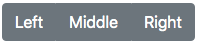
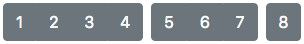
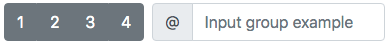
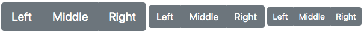
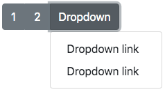
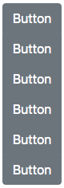

# @lit-element-bootstrap/button-group

An implementation of Bootstrap v4.3.1 button group components in LitElement.

## Live demo

[Go to live demo](https://lit-element-bootstrap.dev/component/buttons-group)

## Installation

Install via npm:

```shell
npm install @lit-element-bootstrap/button-group
```

Install via yarn:

```shell
yarn add @lit-element-bootstrap/button-group
```

Install via unpkg:

```html
https://unpkg.com/@lit-element-bootstrap/button-group@latest/unpkg/index.bundled.js
```

## Import

import all modules:

```javascript
import '@lit-element-bootstrap/button-group';
```

import specific module (preferred):

```javascript
import '@lit-element-bootstrap/button-group/bs-button-group.js';
```

import specific class:

```javascript
// import specific class from all modules
import { BsButtonGroup } from '@lit-element-bootstrap/button-group';

// import specific class
import { BsButtonGroup } from '@lit-element-bootstrap/button-group/bs-button-group.js';
```

## Examples

Button group

```html
<bs-button-group>
    <bs-button context="secondary">Left</bs-button>
    <bs-button context="secondary">Middle</bs-button>
    <bs-button context="secondary">Right</bs-button>
</bs-button-group>
```



Toolbar with button groups

```html
<bs-button-toolbar>
    <bs-button-group style="margin-right: 0.5rem;">
        <bs-button context="secondary">1</bs-button>
        <bs-button context="secondary">2</bs-button>
        <bs-button context="secondary">3</bs-button>
        <bs-button context="secondary">4</bs-button>
    </bs-button-group>
    <bs-button-group style="margin-right: 0.5rem;">
        <bs-button context="secondary">5</bs-button>
        <bs-button context="secondary">6</bs-button>
        <bs-button context="secondary">7</bs-button>
    </bs-button-group>
    <bs-button-group style="margin-right: 0.5rem;">
        <bs-button context="secondary">8</bs-button>
    </bs-button-group>
</bs-button-toolbar>
```



Toolbar with button group and input group

```html
<bs-button-toolbar style="margin-bottom: 1rem;">
    <bs-button-group style="margin-right: 0.5rem;">
        <bs-button context="secondary">1</bs-button>
        <bs-button context="secondary">2</bs-button>
        <bs-button context="secondary">3</bs-button>
        <bs-button context="secondary">4</bs-button>
    </bs-button-group>
    <bs-input-group>
        <bs-input-group-prepend>
            <bs-input-group-text>@</bs-input-group-text>
        </bs-input-group-prepend>
        <bs-form-input placeholder="Input group example"></bs-form-input>
    </bs-input-group>
</bs-button-toolbar>
```



Button group sizes

```html
<bs-button-group size="large">
    <bs-button context="secondary">Left</bs-button>
    <bs-button context="secondary">Middle</bs-button>
    <bs-button context="secondary">Right</bs-button>
</bs-button-group>

<bs-button-group>
    <bs-button context="secondary">Left</bs-button>
    <bs-button context="secondary">Middle</bs-button>
    <bs-button context="secondary">Right</bs-button>
</bs-button-group>

<bs-button-group size="small">
    <bs-button context="secondary">Left</bs-button>
    <bs-button context="secondary">Middle</bs-button>
    <bs-button context="secondary">Right</bs-button>
</bs-button-group>
```



Button group with a dropdown

```html
<bs-button-group>
    <bs-button context="secondary">1</bs-button>
    <bs-button context="secondary">2</bs-button>
    <bs-button-group>
        <bs-dropdown>
            <bs-button context="secondary" dropdown-toggle>Dropdown</bs-button>
            <bs-dropdown-menu down x-placement="bottom-start">
                <bs-dropdown-item-link index="0" title="Dropdown link"></bs-dropdown-item-link>
                <bs-dropdown-item-link index="1" title="Dropdown link"></bs-dropdown-item-link>
            </bs-dropdown-menu>
        </bs-dropdown>
    </bs-button-group>
</bs-button-group>
```



Button group in a vertical direction

```html
<bs-button-group direction="vertical">
    <bs-button context="secondary">Button</bs-button>
    <bs-button context="secondary">Button</bs-button>
    <bs-button context="secondary">Button</bs-button>
    <bs-button context="secondary">Button</bs-button>
    <bs-button context="secondary">Button</bs-button>
    <bs-button context="secondary">Button</bs-button>
</bs-button-group>
```



## Components

Tag | Class |
--- | --- |
`<bs-button-group>` | BsButtonGroup |
`<bs-button-toolbar` | BsButtonToolbar |

## Components
Styles | Export |
--- | --- |
`bs-button-group.css.js` | BsButtonGroupCss
`bs-button-toolbar.css.js` | BsButtonToolbarCss
`bs-button-group-size.css.js` | BsButtonGroupSizeCss
`bs-button-group-direction.css.js` | BsButtonGroupDirectionCss

## Slots

Component | Name | Description |
--- | --- | --- |
`<bs-button-group>` | slot | Place button elements |
`<bs-button-toolbar` | slot | Place button groups elements |

## Theming

#### BsButtonGroup

Property | Default value | Description
--- | --- | --- |
--btn-group-position | relative | Button group position
--btn-group-display | inline-flex | Button group display
--btn-group-vertical-align | middle | Button group vertical align
--btn-group-btn-position | relative | Button items position
--btn-group-btn-flex | 0 1 auto | Button items flex
--btn-group-btn-z-index-hover | 1 | Button items hover z-index
--btn-group-btn-z-index-active | 1 | Button items active z-index
--btn-group-btn-pd-top-sm | 0.25rem | Small size button items top padding
--btn-group-btn-pd-bottom-sm | 0.25rem | Small size button items bottom padding
--btn-group-btn-pd-left-sm | 0.5rem | Small size button items left padding
--btn-group-btn-pd-right-sm | 0.5rem | Small size button items right padding
--btn-group-btn-font-size-sm | 0.875rem | Small size button items font size
--btn-group-btn-line-height-sm | 1.5 | Small size button items line height
--btn-group-btn-top-left-radius-sm | 0.2rem | Small size button items top left border radius
--btn-group-btn-bottom-left-radius-sm | 0.2rem | Small size button items bottom left border radius
--btn-group-btn-top-right-radius-sm | 0.2rem | Small size button items top right border radius
--btn-group-btn-bottom-left-radius-sm | 0.2rem | Small size button items bottom left border radius
--btn-group-pd-top-lg | 0.5rem | Large size button items top padding
--btn-group-pd-bottom-lg | 0.5rem | Large size button items bottom padding
--btn-group-pd-left-lg | 1rem | Large size button items left padding
--btn-group-pd-right-lg | 1rem | Large size button items right padding
--btn-group-font-size-lg | 1.25rem | Large size button items font size
--btn-group-line-height-lg | 1.5 | Large size button items line height
--btn-group-top-left-radius-lg | 0.3rem | Large size button items top left border radius
--btn-group-bottom-left-radius-lg | 0.3rem | Large size button items bottom left border radius 
--btn-group-top-right-radius-lg | 0.3rem | Large size button items top right border radius 
--btn-group-bottom-right-radius-lg | 0.3rem | Large size button items bottom right border radius 
--btn-group-btn-bd-top-right-radius-h | 0 | Horizontal button items top right border radius
--btn-group-btn-bd-bottom-right-radius-h | 0 | Horizontal button items bottom right border radius
--btn-group-btn-bd-top-left-radius-h | 0 | Horizontal button items top left border radius
--btn-group-btn-bd-botom-left-radius-h | 0 | Horizontal button items bottom left border radius
--btn-group-flex-direction-v | column | Button group vertical flex direction
--btn-group-align-items-v | flex-start | Button group vertical align items
--btn-group-justify-content-v | center | Button group vertical justify content
--btn-group-btn-width-v | 100% | Vertical button items width
--btn-group-btn-bd-bottom-left-radius-v | 0 | Vertical button items bottom left border radius
--btn-group-btn-bd-bottom-right-radius-v | 0 | Vertical button items bottom right border radius
--btn-group-btn-bd-top-left-radius-v | 0 | Vertical button items top left border radius
--btn-group-btn-bd-top-right-radius-v | 0 | Vertical button items top right border radius
