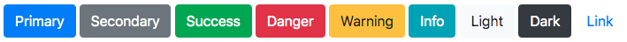
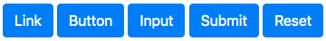
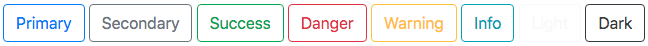
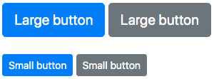
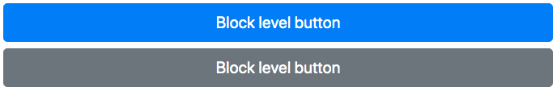
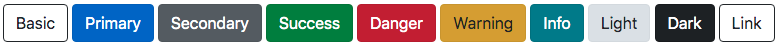
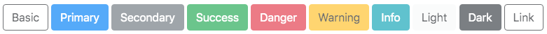

# @lit-element-bootstrap/button

An implementation of Bootstrap v4.3.1 breadcrumb components in LitElement.

## Live demo

[Go to live demo](https://lit-element-bootstrap.dev/component/button)

## Installation

Install via npm:

```shell
npm install @lit-element-bootstrap/button
```

Install via yarn:

```shell
yarn add @lit-element-bootstrap/button
```

Install via unpkg:

```html
https://unpkg.com/@lit-element-bootstrap/button@latest/unpkg/index.bundled.js
```

## Import

import all modules:

```javascript
import '@lit-element-bootstrap/button';
```

import specific module (preferred):

```javascript
import '@lit-element-bootstrap/button/bs-button.js';
```

import specific class:

```javascript
// import specific class from all modules
import { BsButton } from '@lit-element-bootstrap/button';

// import specific class
import { BsButton } from '@lit-element-bootstrap/button/bs-button.js';
```

All buttons share common functionality via a mixin

```javascript
import { BsButtonMixin } from "@lit-element-bootstrap/button/bs-button-mixin.js";
```

To use context themes import the appropiated CSS and include it to the styles array:

```javascript
import { BsButtonPrimaryCss } from '@lit-element-bootstrap/button/css/bs-button-primary.css.js';

static get styles() {
    return [
        BsButtonPrimaryCss
    ];
}
```

For button sizes and block behaviour import appropiated CSS and include it to the styles array:

```javascript
import { BsButtonSizeCss } from '@lit-element-bootstrap/button/css/bs-button-size.css.js';
import { BsButtonBlockCss } from '@lit-element-bootstrap/button/css/bs-button-block.css.js';

static get styles() {
    return [
        BsButtonSizeCss,
        BsButtonBlockCss
    ];
}
```

## Examples

Buttons with context 

```html
<bs-button context="primary">Primary</bs-button>
<bs-button context="secondary">Secondary</bs-button>
<bs-button context="success">Success</bs-button>
<bs-button context="danger">Danger</bs-button>
<bs-button context="warning">Warning</bs-button>
<bs-button context="info">Info</bs-button>
<bs-button context="light">Light</bs-button>
<bs-button context="dark">Dark</bs-button>
<bs-button context="link">Link</bs-button>
```



Button variations

```html
<bs-button-link context="primary">Link</bs-button-link>
<bs-button context="primary" type="submit">Button</bs-button>
<bs-button-input context="primary" label="Input"></bs-button-input>
<bs-button-input context="primary" label="Submit"></bs-button-input>
<bs-button-input context="primary" label="Reset"></bs-button-input>
```



Outline buttons

```html
<bs-button context="primary" outline>Primary</bs-button>
<bs-button context="secondary" outline>Secondary</bs-button>
<bs-button context="success" outline>Success</bs-button>
<bs-button context="danger" outline>Danger</bs-button>
<bs-button context="warning" outline>Warning</bs-button>
<bs-button context="info" outline>Info</bs-button>
<bs-button context="light" outline>Light</bs-button>
<bs-button context="dark" outline>Dark</bs-button>
```



Button sizes

```html
<bs-button context="primary" size="large">Large button</bs-button>
<bs-button context="secondary" size="large">Large button</bs-button>
<bs-button context="primary" size="small">Small button</bs-button>
<bs-button context="secondary" size="small">Small button</bs-button>
```



Block buttons

```html
<bs-button context="primary" size="large" block>Block level button</bs-button>
<bs-button context="secondary" size="large" block>Block level button</bs-button>
```



Active state

```html
<bs-button-link context="primary" active>Primary</bs-button-link>
<bs-button-link context="secondary" active>Secondary</bs-button-link>
<bs-button-link context="success" active>Success</bs-button-link>
<bs-button-link context="danger" active>Danger</bs-button-link>
<bs-button-link context="warning" active>Warning</bs-button-link>
<bs-button-link context="info" active>Info</bs-button-link>
<bs-button-link context="light" active>Light</bs-button-link>
<bs-button-link context="dark" active>Dark</bs-button-link>
<bs-button-link link active>Link</bs-button-link>
```



Disabled state

```html
<bs-button context="primary" disabled>Primary</bs-button>
<bs-button context="secondary" disabled>Secondary</bs-button>
<bs-button context="success" disabled>Success</bs-button>
<bs-button context="danger" disabled>Danger</bs-button>
<bs-button context="warning" disabled>Warning</bs-button>
<bs-button context="info" disabled>Info</bs-button>
<bs-button context="light" disabled>Light</bs-button>
<bs-button context="dark" disabled>Dark</bs-button>
<bs-button link disabled>Link</bs-button>
```



Toggle state

```html
<bs-button context="primary" toggle>Primary toggle</bs-button>
```

Toggle state

```html
<bs-button context="primary" toggle>Primary toggle</bs-button>
```

## Components

Tag | Class |
--- | --- |
`<bs-button>` | BsButton |
`<bs-button-link>` | BsButtonLink |
`<bs-button-input>` | BsButtonInput |

## Methods

Method  | Returns | Description
--- | --- | --- |
activate() | void | asynchronously sets the button in activate state
deactivate() | void | asynchronously removes activate state 
disable() | void | asynchronously sets the button in disable state
enable() | void | asynchronously removes disable state 

## Events

Event | Description
--- | --- |
bs-button-click | Fired when button is clicked |
bs-button-focusout | Fired button loses focus |

## Slots

Component | Name | Description |
--- | --- | --- |
bs-button | slot | Place button content |
bs-button-link | slot | Place link content |


## Theming

Property | Description | Default value
--- | --- | --- |
--btn-text-color - button text color
--btn-bg-color - button background color
--btn-bd-width - button border width | 1px
--btn-bd-style - button border style | solid
--btn-bd-color - button border color | transparent
--btn-bd-top-left-radius - button border top left radius | 0.25rem
--btn-bd-top-right-radius - button border top right radius | 0.25rem
--btn-bd-bottom-right-radius - button border bottom right radius - defaut: 0.25rem
--btn-bd-bottom-left-radius - button border bottom left radius - default 0.25rem
--btn-display - button display | inline-block
--btn-font-weight - button font weight | 400
--btn-text-align - button text align | center
--btn-white-space - button white space | nowrap
--btn-vertical-align - button vertical align | middle
--btn-width - button width
--btn-height - button height
--btn-flex - button flex
--btn-pd-top - button padding top - default 0.375rem
--btn-pd-bottom - button padding bottom | 0.375rem
--btn-pd-left - button padding left | 0.75rem
--btn-pd-right - button padding right | 0.75rem
--btn-font-size - button font size | 1rem
--btn-line-height- button line height | 1.5
--btn-position - button position
--btn-mg-top - button margin top
--btn-mg-right - button margin right
--btn-mg-left - button margin left
--btn-mg-bottom - button margin bottom
--btn-display-after - button ::after display
--btn-width-after - button ::after width
--btn-height-after - button ::after height
--btn-margin-left-after - button ::after margin left
--btn-vertical-align-after - button ::after vertical align
--btn-content-after - button ::after content
--btn-border-top-after - button ::after border top
--btn-border-right-after - button ::after border right after
--btn-border-bottom-after - button ::after border bottom
--btn-border-left-after - button ::after border left
--btn-margin-left-empty-after button ::after:empty margin left
--btn-display-before - button ::before display
--btn-width-before - button ::before width
--btn-height-before - button ::before height
--btn-margin-left-before - button ::before margin left
--btn-vertical-align-before - button ::before vertical align
--btn-content-before - button ::before content
--btn-border-top-before - button ::before border top
--btn-border-right-before - button ::before border right
--btn-border-bottom-before - button ::before border bottom
--btn-border-left-before - button ::before border left
--btn-text-color-hover - button hover text color | #212529
--btn-text-decoration-hover - button hover text decoration | none
--btn-z-index-hover - button hover z-index
--btn-bd-color-hover - button hover border color
--btn-box-shadow-hover - button hover box shadow
--btn-bg-color-hover - button hover background color
--btn-box-shadow-focus - button focus box-shadow | 0 0 0 0.2rem rgba(0, 123, 255, 0.25)
--btn-text-color-focus - button focus text color
--btn-z-index-focus - button focus z-index
--btn-bg-color-focus - button focus background color
--btn-bd-color-focus - button focus border color
--btn-text-color-disabled - button disabled text color
--btn-bg-color-disabled - button disabled background color
--btn-bd-color-disabled - button disabled border color
--btn-opacity-disabled - button disabled opacity | 0.65
--btn-pointer-events-disabled - button disabled pointer-events | none
--btn-text-color-active - button active text color
--btn-bg-color-active - button active background color
--btn-bd-color-active - button active border color
--btn-box-shadow-active-focus - button active focus box-shadow
--btn-z-index-active - button active z-index

### primary css

Property | Description | Default value
--- | --- | --- |
--btn-primary-text-color, #fff
--btn-primary-bg-color, var(--primary-color));
--btn-primary-bd-color, var(--primary-color));
--btn-primary-text-color-hover, #fff);
--btn-primary-bg-color-hover, #0069d9);
--btn-primary-bd-color-hover, #0062cc);
--btn-primary-bd-color-focus, #0062cc);
--btn-primary-bg-color-focus, #0069d9);
--btn-primary-text-color-focus, #fff);
--btn-primary-box-shadow-focus, 0 0 0 0.2rem rgba(38, 143, 255, 0.5)
--btn-primary-text-color-disabled, #fff);
--btn-primary-bg-color-disabled, var(--primary-color)
--btn-primary-bd-color-disabled, var(--primary-color)
--btn-primary-text-color-active, #fff);
--btn-primary-bg-color-active, #0062cc);
--btn-primary-bd-color-active, #005cbf);
--btn-primary-box-shadow-active-focus, 0 0 0 0.2rem rgba(0, 123, 255, 0.5)
--btn-outline-primary-text-color, var(--primary-color)
--btn-outline-primary-bg-color, transparent);
--btn-outline-primary-bd-color, var(--primary-color)
--btn-outline-primary-text-color-hover, #fff
--btn-outline-primary-bg-color-hover, var(--primary-color)
--btn-outline-primary-bd-color-hover, var(--primary-color)
--btn-outline-primary-box-shadow-focus, 0 0 0 0.2rem rgba(0, 123, 255, 0.5)
--btn-outline-primary-text-color-disabled var(--primary-color)
--btn-outline-primary-bg-color-disabled, transparent
--btn-outline-primary-text-color-active, #fff
--btn-outline-primary-bg-color-active, var(--primary-color)
--btn-outline-primary-bd-color-active, var(--primary-color)
--btn-outline-primary-box-shadow-active-focus, 0 0 0 0.2rem rgba(0, 123, 255, 0.5)
